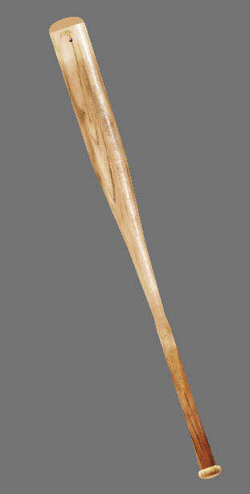
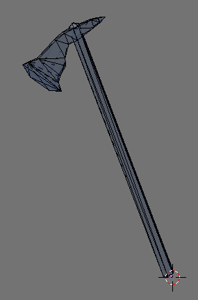
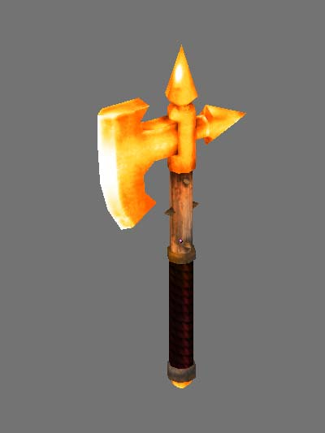
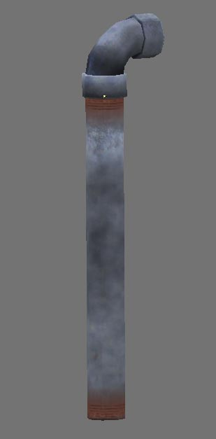
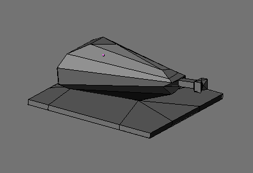

# ⚔️ Armory Model Pack

Weapons and defensive equipment.

## 🖼️ Showcase

     

## 📦 Included Models

| Model | Status |
| :--- | :--- |
| [baseball_bat_001](baseball_bat_001/) | [x] Integrated |
| [battle_axe_001](battle_axe_001/) | [x] Integrated |
| [chaos_axe_001](chaos_axe_001/) | [x] Integrated |
| [cleaver_001](cleaver_001/) | [x] Integrated |
| [hatchet_001](hatchet_001/) | [x] Integrated |
| [katana_001](katana_001/) | [x] Integrated |
| [kitchen_knife_001](kitchen_knife_001/) | [x] Integrated |
| [lead_pipe_001](lead_pipe_001/) | [x] Integrated |
| [machete_001](machete_001/) | [x] Integrated |
| [roman_shield_001](roman_shield_001/) | [x] Integrated |
| [shank_001](shank_001/) | [x] Integrated |
| [shovel_001](shovel_001/) | [x] Integrated |
| [sword_002](sword_002/) | [x] Integrated |
| [wood_axe_001](wood_axe_001/) | [x] Integrated |

## 📅 Latest Update
- **Last Checked:** 2026-03-01
- **Status:** Distribution via GitHub (Rolling Updates).

## 📜 Usage
These models are part of the Low Poly Coop project. Refer to the root [README.md](../../README.md) and [lowpolycoop_license.txt](../../lowpolycoop_license.txt) for licensing information.
