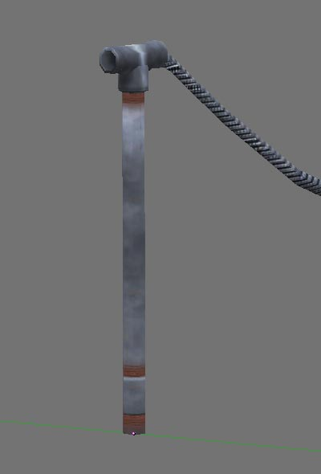
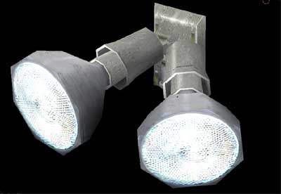

# 🏙 Gilman Model Pack

Urban and industrial props for city environments.

## 🖼️ Showcase

     

## 📦 Included Models

| Model | Status |
| :--- | :--- |
| [balloons_001](balloons_001/) | [x] Integrated |
| [bike_rack_001](bike_rack_001/) | [x] Integrated |
| [broom_001](broom_001/) | [x] Integrated |
| [cafe_table_001](cafe_table_001/) | [x] Integrated |
| [cinder_block_001](cinder_block_001/) | [x] Integrated |
| [crosswalk_button_001](crosswalk_button_001/) | [x] Integrated |
| [fence_001](fence_001/) | [x] Integrated |
| [fence_pipe_chain_001](fence_pipe_chain_001/) | [x] Integrated |
| [floodlight_001](floodlight_001/) | [x] Integrated |
| [garden_border_001](garden_border_001/) | [x] Integrated |
| [hydrant_001](hydrant_001/) | [x] Integrated |
| [lamp_001](lamp_001/) | [x] Integrated |
| [lamp_002](lamp_002/) | [x] Integrated |
| [lawn_light_001](lawn_light_001/) | [x] Integrated |
| [lightpole_001](lightpole_001/) | [x] Integrated |
| [mailbox_001](mailbox_001/) | [x] Integrated |
| [mailbox_002](mailbox_002/) | [x] Integrated |
| [mailbox_003](mailbox_003/) | [x] Integrated |
| [meter_001](meter_001/) | [x] Integrated |
| [pallet_001](pallet_001/) | [x] Integrated |
| [parking_barrier_001](parking_barrier_001/) | [x] Integrated |
| [pipe_cage_001](pipe_cage_001/) | [x] Integrated |
| [pot_001](pot_001/) | [x] Integrated |
| [rail_001](rail_001/) | [x] Integrated |
| [rail_endcap_001](rail_endcap_001/) | [x] Integrated |
| [sandwich_board_001](sandwich_board_001/) | [x] Integrated |
| [sidewalk_barrier_001](sidewalk_barrier_001/) | [x] Integrated |
| [sign_25mph_001](sign_25mph_001/) | [x] Integrated |
| [sign_bump_001](sign_bump_001/) | [x] Integrated |
| [sign_bus_001](sign_bus_001/) | [x] Integrated |
| [sign_crossing_001](sign_crossing_001/) | [x] Integrated |
| [spigot_001](spigot_001/) | [x] Integrated |
| [sprinkler_001](sprinkler_001/) | [x] Integrated |
| [stop_sign_001](stop_sign_001/) | [x] Integrated |
| [street_bench_001](street_bench_001/) | [x] Integrated |
| [street_sign_001](street_sign_001/) | [x] Integrated |
| [streetlight_001](streetlight_001/) | [x] Integrated |
| [streetlight_002](streetlight_002/) | [x] Integrated |
| [streetlight_003](streetlight_003/) | [x] Integrated |
| [switchbox_001](switchbox_001/) | [x] Integrated |
| [traffic_cone_001](traffic_cone_001/) | [x] Integrated |
| [trash_can_001](trash_can_001/) | [x] Integrated |
| [trash_can_002](trash_can_002/) | [x] Integrated |
| [wire_conduit_001](wire_conduit_001/) | [x] Integrated |

## 📅 Latest Update
- **Last Checked:** 2026-03-01
- **Status:** Distribution via GitHub (Rolling Updates).

## 📜 Usage
These models are part of the Low Poly Coop project. Refer to the root [README.md](../../README.md) and [lowpolycoop_license.txt](../../lowpolycoop_license.txt) for licensing information.
