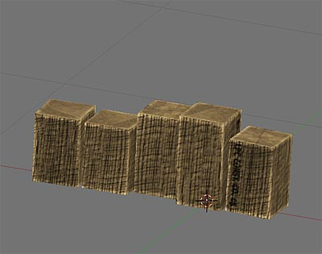

# garden_border_001

## 🛠 Status
- [x] **Model Created** (bewilderbug)
- [x] **UV Unwrapped** (bewilderbug)
- [x] **UV Layout Generated** (bewilderbug)
- [x] **Diffuse Texture Map** (bewilderbug)
- [x] **Integrated into Repository** (bewilderbug)

## 📊 Technical Details
| Attribute | Specification |
| :--- | :--- |
| **Author(s)** | Scott Hsu-Storaker |
| **Geometry** | 60 tris |
| **Base Model** | `garden_border_001.blend` |
| **Primary Texture** | `garden_border_001_tx512.png` |
| **UV Template** | `garden_border_001_uv1024.png` |
| **Source Reference** | `garden_border_001_source.jpg` |
| **Screenshot** | `garden_border_001_screen.jpg` |

## 🖼 Screenshots

## 📝 Notes
[No additional notes]
