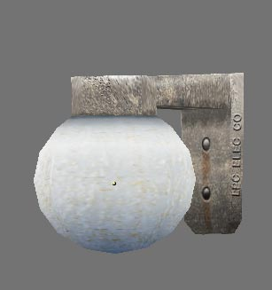

# lamp_001

## 🛠 Status
- [x] **Model Created** (bewilderbug)
- [x] **UV Unwrapped** (bewilderbug)
- [x] **UV Layout Generated** (bewilderbug)
- [x] **Diffuse Texture Map** (bewilderbug)
- [x] **Integrated into Repository** (bewilderbug)
- [ ] **Material converted to nodes**

## 📊 Technical Details
| Attribute | Specification |
| :--- | :--- |
| **Author(s)** | Scott Hsu-Storaker |
| **Geometry** | 178 tris |
| **Base Model** | `lamp_001.blend` |
| **Primary Texture** | `lamp_001_off_tx512.png, lamp_001_on_tx512.png` |
| **UV Template** | `lamp_001_uv1024.png` |
| **Source Reference** | `lamp_001_source.jpg` |
| **Screenshot** | `lamp_001_off_screen.jpg, lamp_001_on_screen.jpg` |

## 🖼 Screenshots

## 📝 Notes
The screenshots, lamp_001_off_screen.jpg and lamp_001_on_screen.jpg show what the model looks likes with the two alternate diffuse textures applied. The “on” version of the texture is an alternate that changes the coloring of the diffuse texture, however, this is a texture only and there are no other settings that affect the actual lighting on the model. The ‘off” version is defined as the default texture on the model.
