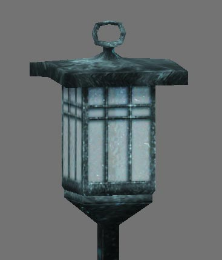

# lawn_light_001

## 🛠 Status
- [x] **Model Created** (bewilderbug)
- [x] **UV Unwrapped** (bewilderbug)
- [x] **UV Layout Generated** (bewilderbug)
- [x] **Diffuse Texture Map** (bewilderbug)
- [x] **Integrated into Repository** (bewilderbug)
- [ ] **Material converted to nodes**

## 📊 Technical Details
| Attribute | Specification |
| :--- | :--- |
| **Author(s)** | Scott Hsu-Storaker |
| **Geometry** | 254 tris |
| **Base Model** | `lawn_light_001.blend` |
| **Primary Texture** | `lawn_light_001_off_tx512.png, lawn_light_001_on_tx512.png` |
| **UV Template** | `lawn_light_001_uv1024.png` |
| **Source Reference** | `lawn_light_001_source.jpg` |
| **Screenshot** | `lawn_light_off_001_screen.jpg, lawn_light_on_001_screen.jpg` |

## 🖼 Screenshots

## 📝 Notes
The “on” version of the texture is an alternate that changes the coloring of the diffuse texture, however, this is a texture only and there are no other settings that affect the actual lighting on the model. The ‘off” version is defined as the default texture on the model.
