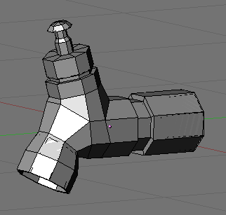

# spigot_001

## 🛠 Status
- [x] **Model Created** (bewilderbug)
- [x] **UV Unwrapped** (bewilderbug)
- [x] **UV Layout Generated** (bewilderbug)
- [x] **Diffuse Texture Map** (Terrence M)
- [x] **Integrated into Repository** (bewilderbug)

## 📊 Technical Details
| Attribute | Specification |
| :--- | :--- |
| **Author(s)** | Terrence M, Scott Hsu-Storaker |
| **Geometry** | 418 tris |
| **Base Model** | `spigot_001.blend` |
| **Primary Texture** | `spigot_001_tx512.png` |
| **UV Template** | `spigot_001_uv1024.png` |
| **Source Reference** | `spigot_001_source.jpg` |
| **Screenshot** | `spigot_001_screen.png` |

## 🖼 Screenshots

## 📝 Notes
[No additional notes]
