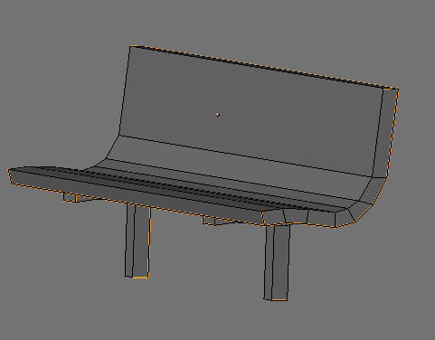

# street_bench_001

## 🛠 Status
- [x] **Model Created** (bewilderbug) ([User])
- [ ] **UV Unwrapped** ([User])
- [ ] **UV Layout Generated** ([User])
- [ ] **Diffuse Texture Map** ([User])
- [ ] **Integrated into Repository** ([User])

## 📊 Technical Details
| Attribute | Specification |
| :--- | :--- |
| **Author(s)** | Scott Hsu-Storaker [add name(s)] |
| **Geometry** | 200 tris |
| **Base Model** | `filename.blend` |
| **Primary Texture** | `street_bench_tex.png` |
| **UV Template** | `street_bench_001_uv1024.png` |
| **Source Reference** | `filename_source.jpg` |
| **Screenshot** | `street_bench_001_screen.png` |

## 🖼 Screenshots
<!-- Add any screenshots below -->

## 📝 Notes
[Add any additional notes]
