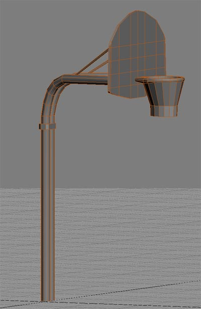
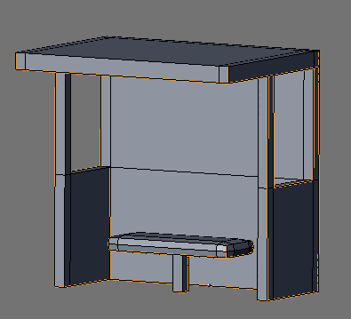
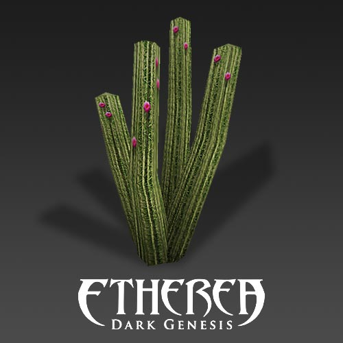
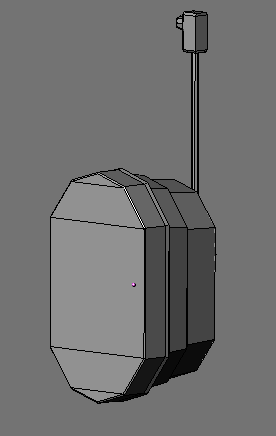
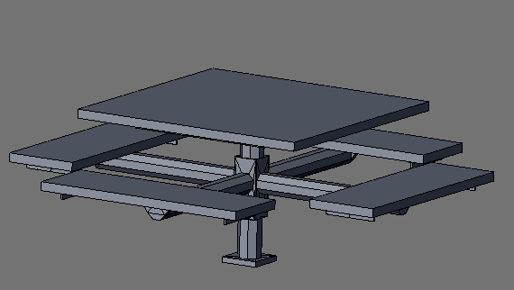

# 🌳 Ohlone Model Pack

Park, trail, and outdoor recreation assets.

## 🖼️ Showcase

     

## 📦 Included Models

| Model | Status |
| :--- | :--- |
| [basketball_hoop_001](basketball_hoop_001/) | [x] Integrated |
| [bus_shelter_001](bus_shelter_001/) | [x] Integrated |
| [cactus_001](cactus_001/) | [x] Integrated |
| [callbox_001](callbox_001/) | [x] Integrated |
| [courtyard_table_001](courtyard_table_001/) | [x] Integrated |
| [cross_sign_001](cross_sign_001/) | [x] Integrated |
| [dog_bags_001](dog_bags_001/) | [x] Integrated |
| [drinking_fountain_001](drinking_fountain_001/) | [x] Integrated |
| [fountain_old_001](fountain_old_001/) | [x] Integrated |
| [fusebox_001](fusebox_001/) | [x] Integrated |
| [garden_light_001](garden_light_001/) | [x] Integrated |
| [greenway_sign_001](greenway_sign_001/) | [x] Integrated |
| [grill_001](grill_001/) | [x] Integrated |
| [iron_fence_001](iron_fence_001/) | [x] Integrated |
| [lamp_003](lamp_003/) | [x] Integrated |
| [lamp_004](lamp_004/) | [x] Integrated |
| [ohl_trash_can_001](ohl_trash_can_001/) | [x] Integrated |
| [park_bench_001](park_bench_001/) | [x] Integrated |
| [park_lamp_001](park_lamp_001/) | [x] Integrated |
| [park_table_001](park_table_001/) | [x] Integrated |
| [rock_001](rock_001/) | [x] Integrated |
| [sign_case_001](sign_case_001/) | [x] Integrated |
| [trail_barrier_001](trail_barrier_001/) | [x] Integrated |
| [trail_fence_001](trail_fence_001/) | [x] Integrated |
| [transformer_block_001](transformer_block_001/) | [x] Integrated |

## 📅 Latest Update
- **Last Checked:** 2026-03-01
- **Status:** Distribution via GitHub (Rolling Updates).

## 📜 Usage
These models are part of the Low Poly Coop project. Refer to the root [README.md](../../README.md) and [lowpolycoop_license.txt](../../lowpolycoop_license.txt) for licensing information.
