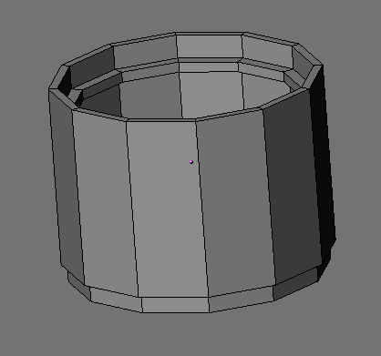
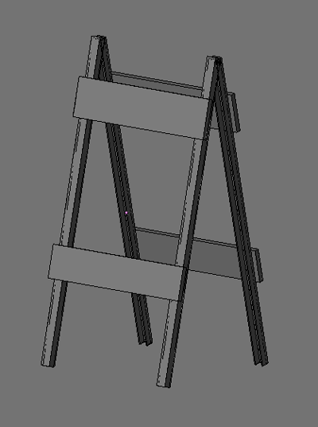
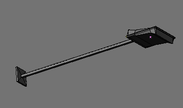
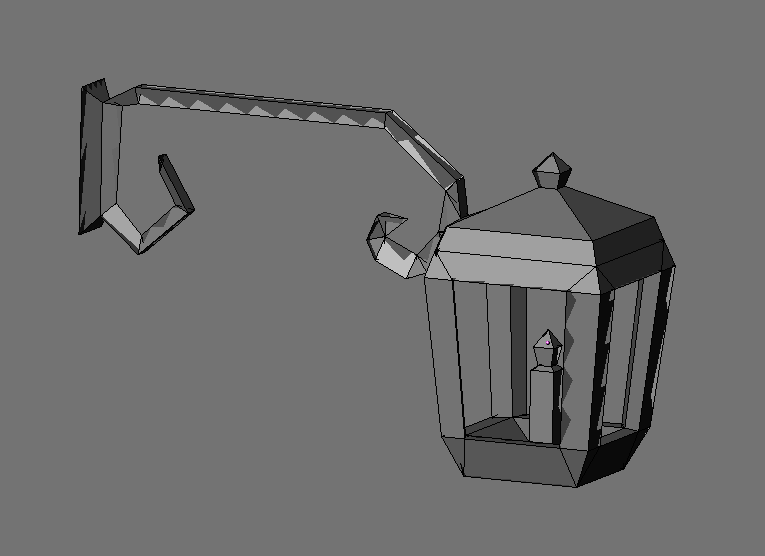
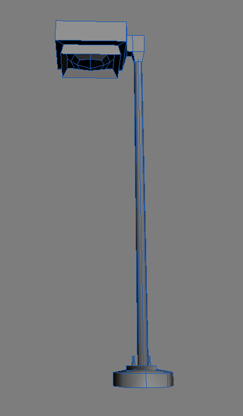

# 🏗️ SOMA Model Pack

Industrial, utility, and construction assets.

## 🖼️ Showcase

     

## 📦 Included Models

| Model | Status |
| :--- | :--- |
| [concrete_pipe_001](concrete_pipe_001/) | [x] Integrated |
| [const_barrier_001](const_barrier_001/) | [x] Integrated |
| [exterior_lamp_002](exterior_lamp_002/) | [x] Integrated |
| [fusebox_001](fusebox_001/) | [x] Integrated |
| [lamp_001](lamp_001/) | [x] Integrated |
| [lamp_003](lamp_003/) | [x] Integrated |
| [parking_barrier_002](parking_barrier_002/) | [x] Integrated |
| [pipe_valve_003](pipe_valve_003/) | [x] Integrated |
| [rail_section_002](rail_section_002/) | [x] Integrated |
| [roof_vent_001](roof_vent_001/) | [x] Integrated |
| [security_cam_001](security_cam_001/) | [x] Integrated |
| [tel_pole_001](tel_pole_001/) | [x] Integrated |
| [transformer_block_001](transformer_block_001/) | [x] Integrated |
| [util_carguard_001](util_carguard_001/) | [x] Integrated |
| [water_tower_001](water_tower_001/) | [x] Integrated |

## 📅 Latest Update
- **Last Checked:** 2026-03-01
- **Status:** Distribution via GitHub (Rolling Updates).

## 📜 Usage
These models are part of the Low Poly Coop project. Refer to the root [README.md](../../README.md) and [lowpolycoop_license.txt](../../lowpolycoop_license.txt) for licensing information.
