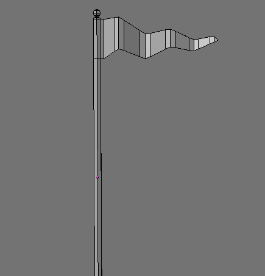
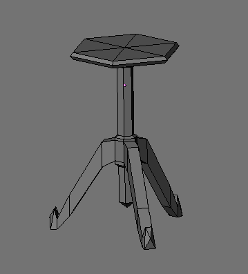
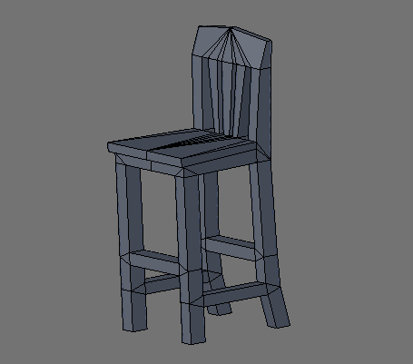
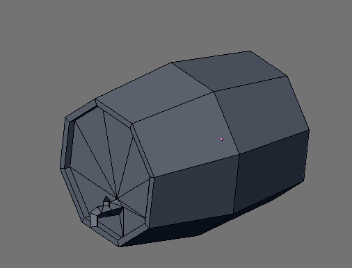
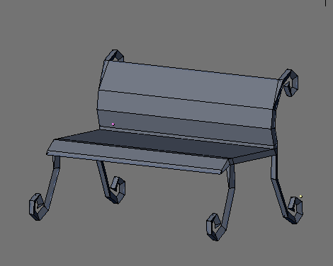

# 🍺 Tavern Model Pack

Interior props for shops, taverns, and homes.

## 🖼️ Showcase

     

## 📦 Included Models

| Model | Status |
| :--- | :--- |
| [banner_001](banner_001/) | [x] Integrated |
| [barstool_001](barstool_001/) | [x] Integrated |
| [barstool_002](barstool_002/) | [x] Integrated |
| [beer_barrel_001](beer_barrel_001/) | [x] Integrated |
| [bench_park_001](bench_park_001/) | [x] Integrated |
| [booth_001](booth_001/) | [x] Integrated |
| [chair_001](chair_001/) | [x] Integrated |
| [chair_002](chair_002/) | [x] Integrated |
| [chair_003](chair_003/) | [x] Integrated |
| [flagon_001](flagon_001/) | [x] Integrated |
| [shortstool_001](shortstool_001/) | [x] Integrated |
| [shortstool_003](shortstool_003/) | [x] Integrated |
| [smudgepot_001](smudgepot_001/) | [x] Integrated |
| [table_001](table_001/) | [x] Integrated |
| [table_002](table_002/) | [x] Integrated |
| [tavern_sign_001](tavern_sign_001/) | [x] Integrated |

## 📅 Latest Update
- **Last Checked:** 2026-03-01
- **Status:** Distribution via GitHub (Rolling Updates).

## 📜 Usage
These models are part of the Low Poly Coop project. Refer to the root [README.md](../../README.md) and [lowpolycoop_license.txt](../../lowpolycoop_license.txt) for licensing information.
